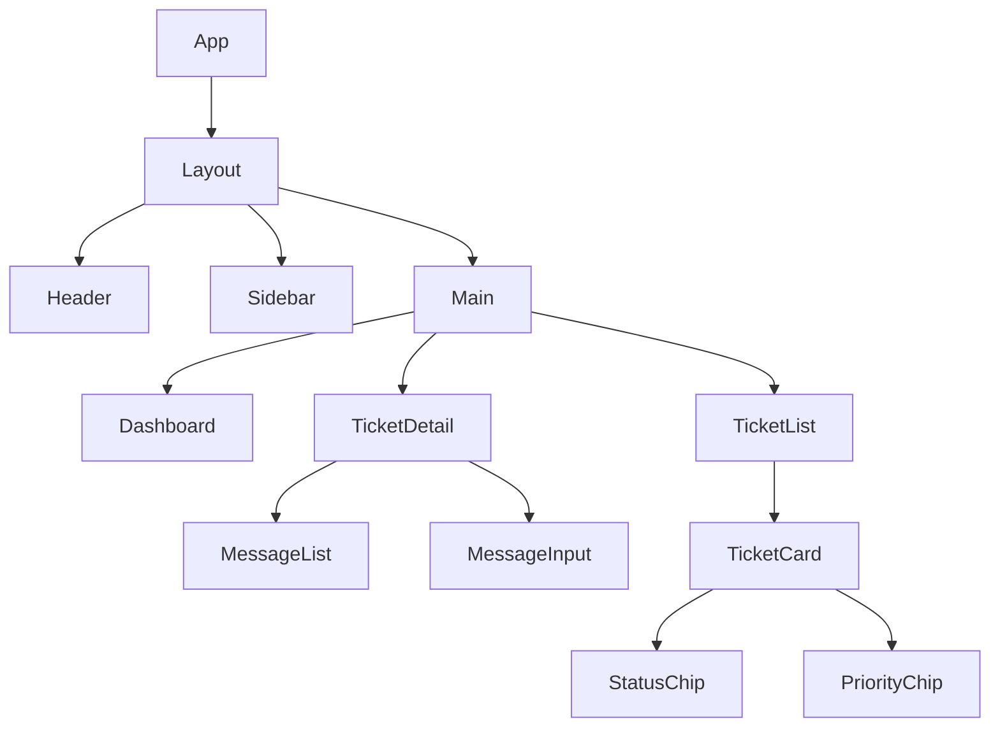

# 🎫 Enterprise Support Ticketing System

[](https://support-ticketing-system-ly6q.vercel.app/)
[](https://reactjs.org/)
[](https://www.typescriptlang.org/)
[](https://mui.com/)
[](https://redux-toolkit.js.org/)

## 🌟 **Live Demo**

🚀 **[View Live Application](https://support-ticketing-system-ly6q.vercel.app/)**

> **Demo Credentials:**
>
> - **Admin:** admin@example.com / admin123
> - **Agent:** agent@example.com / agent123
> - **Customer:** customer@example.com / customer123

---

## 📋 **Table of Contents**

1. [Overview](#-overview)
2. [Features](#-features)
3. [Technology Stack](#-technology-stack)
4. [Architecture](#-architecture)
5. [Installation](#-installation)
6. [Usage](#-usage)
7. [API Integration](#-api-integration)
8. [Real-time Features](#-real-time-features)
9. [Role-based Access](#-role-based-access)
10. [Components Structure](#-components-structure)
11. [State Management](#-state-management)
12. [Deployment](#-deployment)
13. [Screenshots](#-screenshots)
14. [Contributing](#-contributing)
15. [License](#-license)

---

## 🎯 **Overview**

An enterprise-grade support ticketing system built with React, TypeScript, and Material-UI. This application provides a comprehensive solution for managing customer support tickets with real-time communication, role-based access control, and modern responsive design.

### **Key Highlights**

- ✅ **Real-time Communication** - WebSocket integration for live updates
- ✅ **Role-based Access Control** - Customer, Agent, and Admin roles
- ✅ **Responsive Design** - Mobile-first approach with Material-UI
- ✅ **Type-safe Development** - Full TypeScript implementation
- ✅ **Modern State Management** - Redux Toolkit with RTK Query
- ✅ **Advanced Filtering** - Multi-criteria ticket filtering and sorting
- ✅ **File Upload Support** - Attachment handling with preview
- ✅ **Notification System** - Toast notifications and in-app alerts

---

## 🚀 **Features**

### **Core Functionality**

| Feature                 | Description                                       | Status      |
| ----------------------- | ------------------------------------------------- | ----------- |
| **Ticket Management**   | Create, view, update, and manage tickets          | ✅ Complete |
| **Real-time Chat**      | Live messaging within tickets                     | ✅ Complete |
| **File Uploads**        | Attachment support with preview                   | ✅ Complete |
| **Advanced Filtering**  | Filter by status, priority, assignee, tags, dates | ✅ Complete |
| **Pagination**          | Efficient data loading with pagination            | ✅ Complete |
| **Responsive Design**   | Mobile-optimized interface                        | ✅ Complete |
| **Dashboard Analytics** | Visual charts and statistics                      | ✅ Complete |
| **Notification System** | Real-time alerts and notifications                | ✅ Complete |

### **User Roles & Permissions**

#### 👤 **Customer**

- Create new support tickets
- View their own tickets
- Add messages to their tickets
- Upload attachments
- View ticket status updates

#### 🛠️ **Agent**

- View assigned tickets
- Update ticket status and priority
- Assign tickets to other agents
- Respond to customer messages
- Access agent dashboard

#### 👑 **Admin**

- Full system access
- User management
- Ticket oversight
- System analytics
- Role management

---

## 🛠️ **Technology Stack**

### **Frontend**

- **React 18.x** - Modern React with hooks and concurrent features
- **TypeScript 5.x** - Type-safe development
- **Material-UI (MUI) 5.x** - Comprehensive component library
- **Redux Toolkit** - Predictable state management
- **RTK Query** - Efficient data fetching and caching
- **React Router 6** - Client-side routing
- **React Hook Form** - Performant form handling
- **Date-fns** - Modern date utility library

### **Real-time Communication**

- **@stomp/stompjs** - WebSocket communication
- **SockJS** - WebSocket fallback support

### **Development Tools**

- **Vite** - Fast build tool and dev server
- **ESLint** - Code linting
- **Prettier** - Code formatting
- **TypeScript** - Static type checking

### **Deployment**

- **Vercel** - Production deployment platform
- **Docker** - Containerization support

---

## 🏗️ **Architecture**

### **Project Structure**

```
src/
├── components/          # Reusable UI components
│   ├── Layout/         # Layout components
│   ├── Forms/          # Form components
│   ├── Tables/         # Table components
│   └── Common/         # Shared components
├── pages/              # Route-level components
│   ├── Dashboard/      # Dashboard page
│   ├── Tickets/        # Ticket management
│   ├── Login/          # Authentication
│   └── Profile/        # User profile
├── store/              # Redux store configuration
│   ├── slices/         # Redux slices
│   └── api/            # RTK Query APIs
├── hooks/              # Custom React hooks
├── utils/              # Utility functions
├── types/              # TypeScript type definitions
├── services/           # API service functions
├── constants/          # Application constants
└── theme/              # Material-UI theme configuration
```

### **Component Architecture**



---

## 📦 **Installation**

### **Prerequisites**

- Node.js 18.x or higher
- npm or yarn package manager
- Git

### **Local Development Setup**

```bash
# Clone the repository
git clone https://github.com/kr-rajnish/support-ticketing-system.git

# Navigate to project directory
cd support-ticketing-system

# Install dependencies
npm install

# Create environment file
cp .env.example .env.local

# Start development server
npm run dev
```

### **Environment Variables**

Create a `.env.local` file in the project root:

```env
# API Configuration
VITE_API_BASE_URL=http://localhost:8080/api
VITE_WS_URL=ws://localhost:8080/ws

# Application Settings
VITE_APP_NAME=Support Ticketing System
VITE_APP_VERSION=1.0.0

# Features Flags
VITE_ENABLE_REAL_TIME=true
VITE_ENABLE_FILE_UPLOAD=true

---

## 📖 **Usage**

### **Getting Started**

1. **Access the Application**
   - Navigate to [https://support-ticketing-system-ly6q.vercel.app/](https://support-ticketing-system-ly6q.vercel.app/)
   - Use demo credentials or create a new account

2. **Customer Workflow**
```

Login → Dashboard → Create Ticket → Add Messages → Track Status

```

3. **Agent Workflow**
```

Login → View Assigned Tickets → Update Status → Respond to Messages

```

4. **Admin Workflow**
```

Login → Dashboard → Manage Users → Oversee Tickets → View Analytics

````

### **Key Features Guide**

#### **Creating a Ticket**
```typescript
// Example ticket creation
const ticketData = {
title: "Unable to login to account",
description: "Getting error message when trying to log in",
priority: "HIGH",
tags: ["login", "authentication"]
};
````

#### **Real-time Messaging**

- Messages appear instantly without page refresh
- Typing indicators show when others are typing
- File attachments supported with drag-and-drop

#### **Advanced Filtering**

- Filter by multiple criteria simultaneously
- Save filter presets for quick access
- Export filtered results

---

````

### **File Upload**

```typescript
// Upload attachment
const uploadFile = async (file: File, ticketId: string) => {
  const formData = new FormData();
  formData.append('file', file);
  formData.append('ticketId', ticketId);

  const response = await api.post('/uploads', formData, {
    headers: { 'Content-Type': 'multipart/form-data' }
  });
  return response.data;
};
````

---

## 🔄 **Real-time Features**

### **Real-time Features**

- **Live Message Updates** - Messages appear instantly
- **Status Change Notifications** - Real-time status updates
- **Typing Indicators** - See when others are typing
- **Online/Offline Status** - User presence indicators
- **Automatic Reconnection** - Handles connection drops gracefully

---

## 🧩 **Components Structure**

### **Atomic Components**

### **Environment Setup**

Production environment variables are configured in Vercel dashboard:

- `VITE_API_BASE_URL`
- `VITE_WS_URL`
- `VITE_APP_NAME`

---

## 📝 **API Documentation**

### **Authentication Endpoints**

| Endpoint        | Method | Description      |
| --------------- | ------ | ---------------- |
| `/auth/login`   | POST   | User login       |
| `/auth/logout`  | POST   | User logout      |
| `/auth/refresh` | POST   | Refresh token    |
| `/auth/me`      | GET    | Get current user |

### **Ticket Endpoints**

| Endpoint                | Method | Description        |
| ----------------------- | ------ | ------------------ |
| `/tickets`              | GET    | List tickets       |
| `/tickets`              | POST   | Create ticket      |
| `/tickets/:id`          | GET    | Get ticket details |
| `/tickets/:id`          | PUT    | Update ticket      |
| `/tickets/:id/messages` | POST   | Add message        |

---

## 📄 **License**

This project is licensed under the MIT License - see the [LICENSE](LICENSE) file for details.

---

## 👨‍💻 **Developer**

**Rajnish Kumar**

- Email: kr.rajnish@example.com
- GitHub: [@kr-rajnish](https://github.com/kr-rajnish)
- LinkedIn: [Rajnish Kumar](https://linkedin.com/in/kr-rajnish)
